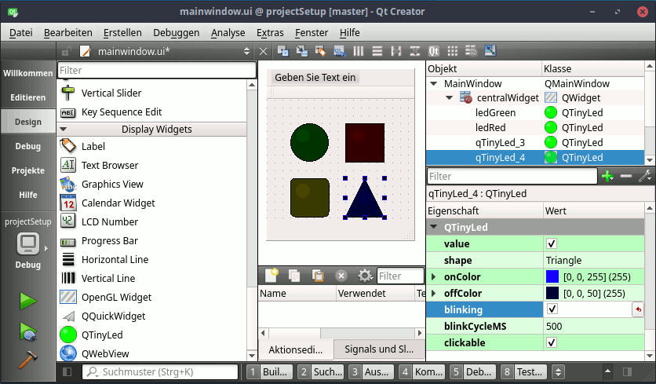

# QTinyLed

A tiny led indicator.
For a simple use case of this project please have a look in the examples folder.

## Showcase
The gif is reducing the color palette -- please ignore the hard transistions.



## Installation
Required components:
- qttools5-dev

The following installation methods has been tested:

### Linux
```
git clone url/QTinyLed.git
mkdir build
cd build
qmake ../QTinyLed
make
sudo make install
```
